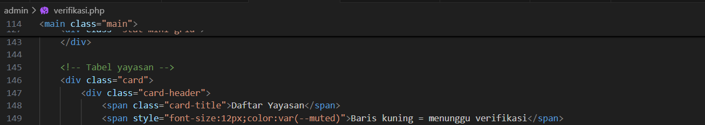
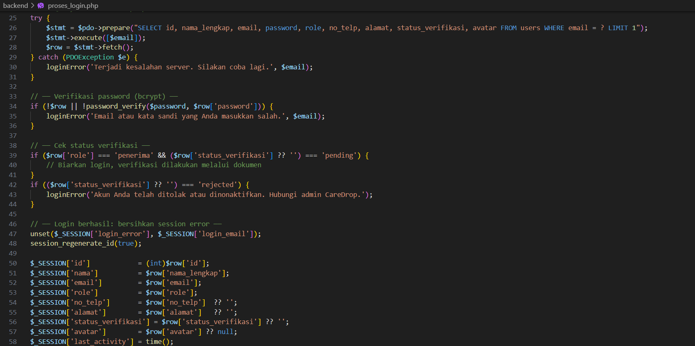
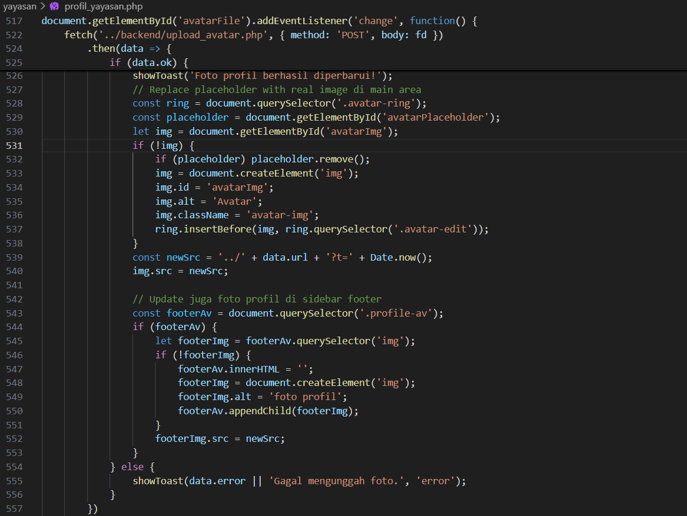
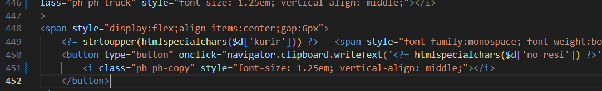
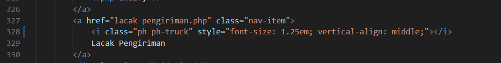
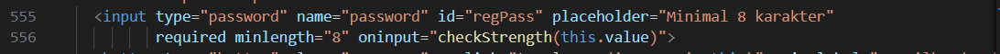
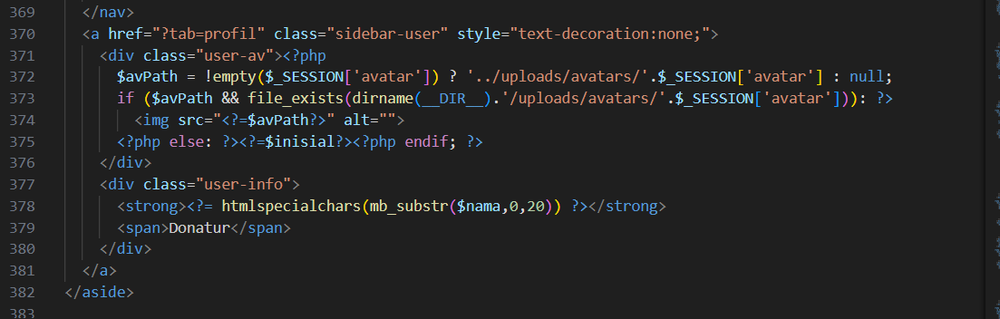

# CareDrop

Sistem Layanan Donasi Barang berbasis Web

## Deskripsi
Website ini akan menyediakan fitur publikasi kebutuhan yayasan/posko dan penawaran donasi barang, sehingga donatur dapat dengan mudah menemukan dan menyalurkan bantuan kepada posko atau yayasan yang tepat. Dengan adanya platform ini, diharapkan alur penyaluran donasi menjadi lebih transparan, terstruktur, dan tepat sasaran.

# Team & Roles
| Nama Anggota | Role | Tanggung Jawab |
|---|---|---|
| Sabrina Salsabila | Frontend & Backend Developer | Mendesain tampilan website, mengembangkan fitur sistem, dan mengelola integrasi frontend-backend |
| Mutia Ayu Safitri | Frontend & Backend Developer | Membuat tampilan antarmuka pengguna serta mengembangkan logika sistem dan fitur backend |
| Baiq Sabrina Ramadhani | Frontend Developer | Mendesain UI/UX dan mengembangkan tampilan website agar responsif dan interaktif |

# User / Actor Website & Features (Menu / Sitemap)
```text
CareDrop
│
├── USER (DONATUR)
│   │
│   ├── Landing Page
│   ├── Katalog Kebutuhan Barang
│   ├── Detail Kebutuhan Barang
│   ├── Sign Up
│   ├── Login
│   │
│   └── Dashboard Donatur
│       ├── Mengajukan Tawaran Donasi Barang
│       ├── Upload Bukti/Tawaran Barang
│       ├── Memasukkan Nomor Resi Pengiriman
│       ├── Melacak Status Pengiriman Barang
│       ├── Riwayat Donasi
│       ├── Unduh E-Sertifikat
│       ├── Kelola Profil
│       └── Logout
│
├── YAYASAN / POSKO
│   │
│   ├── Landing Page
│   ├── Informasi Yayasan
│   ├── Daftar Kebutuhan Barang
│   ├── Sign Up
│   ├── Login
│   │
│   └── Dashboard Yayasan
│       ├── Tambah Kebutuhan Barang
│       ├── Edit Kebutuhan Barang
│       ├── Tutup Daftar Kebutuhan
│       ├── Setujui Tawaran Donasi
│       ├── Tolak Tawaran Donasi
│       ├── Konfirmasi Penerimaan Barang
│       ├── Laporan Penerimaan Donasi
│       ├── Kelola Profil Yayasan
│       ├── Upload Berkas Legalitas
│       └── Logout
│
└── ADMIN
    │
    ├── Landing Page
    ├── Login
    │
    └── Dashboard Admin
        ├── Verifikasi Yayasan Baru
        ├── Kelola Kategori Barang
        ├── Kelola Template E-Sertifikat
        ├── Dashboard Analitik
        ├── Statistik Donasi
        ├── Kelola Data Pengguna
        ├── Kelola Data Yayasan
        └── Logout
```
# Tech Stack

| Technology | Fungsi |
|---|---|
| HTML | Membuat struktur halaman website |
| CSS | Mendesain tampilan dan layout website |
| JavaScript | Menambahkan interaktivitas pada website |
| PHP | Mengembangkan backend dan logika sistem |
| MySQL | Mengelola database sistem |
| Apache | Menjalankan web server localhost |
| XAMPP | Local development environment |

# DBMS Configuration

## DBMS
```text
MySQL
```

## Database Name
```text
caredrop
```

## Server Configuration

| Configuration | Value |
|---|---|
| Host | localhost |
| Username | root |
| Server | Apache (XAMPP) |

---

# Table Specification

## 1. users

| Field | Type | Keterangan |
|---|---|---|
| id_user | INT (PK) | ID pengguna |
| nama | VARCHAR(100) | Nama pengguna |
| email | VARCHAR(100) | Email pengguna |
| password | VARCHAR(255) | Password terenkripsi |
| role | ENUM('donatur','yayasan','admin') | Role pengguna |
| telepon | VARCHAR(20) | Nomor telepon |
| alamat | TEXT | Alamat pengguna |
| created_at | TIMESTAMP | Tanggal akun dibuat |

---

## 2. yayasan

| Field | Type | Keterangan |
|---|---|---|
| id_yayasan | INT (PK) | ID yayasan |
| id_user | INT (FK) | Relasi ke tabel users |
| nama_yayasan | VARCHAR(100) | Nama yayasan |
| legalitas | VARCHAR(255) | File legalitas |
| deskripsi | TEXT | Deskripsi yayasan |
| status_verifikasi | ENUM('pending','verified','rejected') | Status verifikasi |

---

## 3. kategori_barang

| Field | Type | Keterangan |
|---|---|---|
| id_kategori | INT (PK) | ID kategori |
| nama_kategori | VARCHAR(100) | Nama kategori barang |

---

## 4. kebutuhan_barang

| Field | Type | Keterangan |
|---|---|---|
| id_kebutuhan | INT (PK) | ID kebutuhan |
| id_yayasan | INT (FK) | Relasi ke yayasan |
| id_kategori | INT (FK) | Relasi ke kategori |
| nama_barang | VARCHAR(100) | Nama barang |
| jumlah | INT | Jumlah kebutuhan |
| deskripsi | TEXT | Deskripsi barang |
| status | ENUM('aktif','ditutup') | Status kebutuhan |

---

## 5. donasi

| Field | Type | Keterangan |
|---|---|---|
| id_donasi | INT (PK) | ID donasi |
| id_user | INT (FK) | Donatur |
| id_kebutuhan | INT (FK) | Kebutuhan terkait |
| jumlah_barang | INT | Jumlah barang donasi |
| status | ENUM('pending','disetujui','ditolak','dikirim','diterima') | Status donasi |
| created_at | TIMESTAMP | Tanggal donasi dibuat |

---

## 6. pengiriman

| Field | Type | Keterangan |
|---|---|---|
| id_pengiriman | INT (PK) | ID pengiriman |
| id_donasi | INT (FK) | Relasi ke donasi |
| nomor_resi | VARCHAR(100) | Nomor resi |
| jasa_kirim | VARCHAR(50) | Jasa ekspedisi |
| status_pengiriman | VARCHAR(50) | Status pengiriman |

---

## 7. sertifikat

| Field | Type | Keterangan |
|---|---|---|
| id_sertifikat | INT (PK) | ID sertifikat |
| id_donasi | INT (FK) | Relasi ke donasi |
| file_sertifikat | VARCHAR(255) | File sertifikat |
| tanggal_terbit | DATE | Tanggal terbit sertifikat |

---

# Database Relations

```text
users -> yayasan
yayasan -> kebutuhan_barang
## Deskripsi
Website ini akan menyediakan fitur publikasi kebutuhan yayasan/posko dan penawaran donasi barang, sehingga donatur dapat dengan mudah menemukan dan menyalurkan bantuan kepada posko atau yayasan yang tepat. Dengan adanya platform ini, diharapkan alur penyaluran donasi menjadi lebih transparan, terstruktur, dan tepat sasaran.

# Team & Roles
| Nama Anggota | Role | Tanggung Jawab |
|---|---|---|
| Sabrina Salsabila | Frontend & Backend Developer | Mendesain tampilan website, mengembangkan fitur sistem, dan mengelola integrasi frontend-backend |
| Mutia Ayu Safitri | Frontend & Backend Developer | Membuat tampilan antarmuka pengguna serta mengembangkan logika sistem dan fitur backend |
| Baiq Sabrina Ramadhani | Frontend Developer | Mendesain UI/UX dan mengembangkan tampilan website agar responsif dan interaktif |

# User / Actor Website & Features (Menu / Sitemap)
```text
CareDrop
│
├── PENGGUNA PUBLIK
│   ├── Landing Page (index.php)
│   └── Login & Register (login.php)
│
├── USER (DONATUR)
│   │
│   ├── Katalog Kebutuhan Terverifikasi (donatur/katalog.php)
│   │   └── Detail & Ajukan Tawaran Donasi
│   │
│   └── Dashboard Donatur (donatur/dashboard.php)
│       ├── Beranda Status Donasi Aktif
│       ├── Input Nomor Resi Pengiriman
│       ├── Riwayat Semua Donasi
│       ├── E-Sertifikat Donasi (Unduh/Cetak)
│       ├── Kelola Profil Akun
│       └── Logout
│
├── YAYASAN / POSKO
│   │
│   └── Panel Yayasan
│       ├── Dashboard Ringkasan (yayasan/dashboard_yayasan.php)
│       ├── Kelola Kebutuhan Barang (yayasan/kelola_katalog.php)
│       │   ├── Tambah Kebutuhan Baru
│       │   ├── Edit/Hapus Kebutuhan
│       │   └── Pantau Progress Pengumpulan
│       ├── Daftar Tawaran Masuk (yayasan/tawaran_masuk.php)
│       │   └── Setujui / Tolak Tawaran Donatur
│       ├── Konfirmasi Terima Barang (yayasan/konfirmasi_terima.php)
│       ├── Lacak Pengiriman Kurir (yayasan/lacak_pengiriman.php)
│       ├── Profil & Legalitas (yayasan/profil_yayasan.php)
│       │   ├── Perbarui Identitas
│       │   └── Unggah Dokumen Legalitas
│       └── Logout
│
└── ADMIN
    │
    └── Panel Admin (admin/index.php)
        ├── Dashboard Ringkasan & Statistik
        ├── Verifikasi Yayasan Baru (admin/verifikasi.php)
        ├── Kelola Data Pengguna (admin/kelola_user.php)
        ├── Kelola Kategori Kebutuhan (admin/kelola_kategori.php)
        ├── Kelola Seluruh Transaksi Donasi (admin/kelola_donasi.php)
        ├── Manajemen Template Sertifikat (admin/kelola_sertifikat.php)
        ├── Laporan & Analitik Visual (admin/analitik.php)
        └── Logout
```
# Tech Stack

| Technology | Fungsi |
|---|---|
| HTML | Membuat struktur halaman website |
| CSS | Mendesain tampilan dan layout website |
| JavaScript | Menambahkan interaktivitas pada website |
| PHP | Mengembangkan backend dan logika sistem |
| MySQL | Mengelola database sistem |
| Apache | Menjalankan web server localhost |
| XAMPP | Local development environment |

# DBMS Configuration

## DBMS
```text
MySQL
```

## Database Name
```text
caredrop
```

## Server Configuration

| Configuration | Value |
|---|---|
| Host | localhost |
| Username | root |
| Server | Apache (XAMPP) |

---

# Table Specification

## 1. users

| Field | Type | Keterangan |
|---|---|---|
| id_user | INT (PK) | ID pengguna |
| nama | VARCHAR(100) | Nama pengguna |
| email | VARCHAR(100) | Email pengguna |
| password | VARCHAR(255) | Password terenkripsi |
| role | ENUM('donatur','yayasan','admin') | Role pengguna |
| telepon | VARCHAR(20) | Nomor telepon |
| alamat | TEXT | Alamat pengguna |
| created_at | TIMESTAMP | Tanggal akun dibuat |

---

## 2. yayasan

| Field | Type | Keterangan |
|---|---|---|
| id_yayasan | INT (PK) | ID yayasan |
| id_user | INT (FK) | Relasi ke tabel users |
| nama_yayasan | VARCHAR(100) | Nama yayasan |
| legalitas | VARCHAR(255) | File legalitas |
| deskripsi | TEXT | Deskripsi yayasan |
| status_verifikasi | ENUM('pending','verified','rejected') | Status verifikasi |

---

## 3. kategori_barang

| Field | Type | Keterangan |
|---|---|---|
| id_kategori | INT (PK) | ID kategori |
| nama_kategori | VARCHAR(100) | Nama kategori barang |

---

## 4. kebutuhan_barang

| Field | Type | Keterangan |
|---|---|---|
| id_kebutuhan | INT (PK) | ID kebutuhan |
| id_yayasan | INT (FK) | Relasi ke yayasan |
| id_kategori | INT (FK) | Relasi ke kategori |
| nama_barang | VARCHAR(100) | Nama barang |
| jumlah | INT | Jumlah kebutuhan |
| deskripsi | TEXT | Deskripsi barang |
| status | ENUM('aktif','ditutup') | Status kebutuhan |

---

## 5. donasi

| Field | Type | Keterangan |
|---|---|---|
| id_donasi | INT (PK) | ID donasi |
| id_user | INT (FK) | Donatur |
| id_kebutuhan | INT (FK) | Kebutuhan terkait |
| jumlah_barang | INT | Jumlah barang donasi |
| status | ENUM('pending','disetujui','ditolak','dikirim','diterima') | Status donasi |
| created_at | TIMESTAMP | Tanggal donasi dibuat |

---

## 6. pengiriman

| Field | Type | Keterangan |
|---|---|---|
| id_pengiriman | INT (PK) | ID pengiriman |
| id_donasi | INT (FK) | Relasi ke donasi |
| nomor_resi | VARCHAR(100) | Nomor resi |
| jasa_kirim | VARCHAR(50) | Jasa ekspedisi |
| status_pengiriman | VARCHAR(50) | Status pengiriman |

---

## 7. sertifikat

| Field | Type | Keterangan |
|---|---|---|
| id_sertifikat | INT (PK) | ID sertifikat |
| id_donasi | INT (FK) | Relasi ke donasi |
| file_sertifikat | VARCHAR(255) | File sertifikat |
| tanggal_terbit | DATE | Tanggal terbit sertifikat |

---

# Database Relations

```text
users -> yayasan
yayasan -> kebutuhan_barang
kategori_barang -> kebutuhan_barang
users -> donasi
kebutuhan_barang -> donasi
donasi -> pengiriman
donasi -> sertifikat
```

# Project : Bug Log (7 Bug Berdasarkan Riwayat Pengerjaan)

```text
Bug Log 1 (Sisa Konflik Git Merusak Tampilan)
1) Gejala: Terdapat teks aneh seperti `<<<<<<< HEAD` yang merusak dan mengotori tampilan tabel daftar yayasan di panel admin.
2) Langkah reproduksi: Admin membuka menu verifikasi yayasan, lalu melihat teks versi git tercetak bocor di bagian header tabel.
3) Hipotesis penyebab: Kesalahan saat melakukan penggabungan (merge) branch Git sebelumnya, sehingga penanda konflik tertinggal utuh di dalam baris kode PHP.
4) Fix (apa yang diubah): Menghapus baris kode konflik `<<<<<<< HEAD` dan `=======` yang tertinggal.
5) Bukti (Untuk Screenshot):
```

```text
Bug Log 2 (Foto Profil Hilang Saat Login)
1) Gejala: Foto profil pengguna kembali menjadi gambar default kosong setiap kali mereka melakukan logout lalu login kembali.
2) Langkah reproduksi: Pengguna mengunggah foto, berhasil. Tapi saat mencoba logout dan login lagi, foto profil gagal termuat karena data tidak tersimpan di sesi.
3) Hipotesis penyebab: Logika query pengambilan data saat login tidak menyertakan pemanggilan (select) atribut 'avatar' dari database, sehingga session foto selalu kosong.
4) Fix (apa yang diubah): Menambahkan pemanggilan kolom `avatar` pada sintaks SQL query dan menyimpannya ke `$_SESSION['avatar']`.
5) Bukti (Untuk Screenshot):
```

```text
Bug Log 3 (Foto Sidebar Tidak Real-time)
1) Gejala: Setelah yayasan mengunggah foto profil baru, foto di sudut kiri bawah (sidebar footer) tidak ikut berubah secara instan sebelum halaman di-refresh manual.
2) Langkah reproduksi: Yayasan mengubah profil, muncul notifikasi sukses, tapi foto sidebar lama tetap tampil tidak sinkron.
3) Hipotesis penyebab: Fungsi JavaScript untuk proses unggah asinkron (AJAX) hanya diprogram untuk memperbarui src elemen foto utama, namun melewatkan elemen foto di sidebar.
4) Fix (apa yang diubah): Menambahkan logika manipulasi DOM untuk mencari dan memperbarui atribut src pada elemen gambar di dalam class `.profile-av`.
5) Bukti (Untuk Screenshot):
```

```text
Bug Log 4 (Kesulitan Menyalin Nomor Resi)
1) Gejala: Pihak yayasan kerepotan dan lambat dalam menyalin nomor resi pengiriman yang panjang dari donatur, karena harus diblok manual selayaknya teks biasa.
2) Langkah reproduksi: Yayasan membuka tabel penawaran masuk, lalu mencoba memblok teks resi untuk dilacak di website ekspedisi.
3) Hipotesis penyebab: Teks data nomor resi dirender tanpa elemen tombol salin otomatis ke clipboard (kurangnya fitur interaktif UI).
4) Fix (apa yang diubah): Menambahkan tombol ikon kecil dengan event listener `onclick="navigator.clipboard.writeText(...)"` di sebelah output nomor resi.
5) Bukti (Untuk Screenshot):
```

```text
Bug Log 5 (Menu Lacak Pengiriman Belum Ada di Dashboard Yayasan)
1) Gejala: Menu navigasi untuk melacak pengiriman di dashboard yayasan tidak ada.
2) Langkah reproduksi: Yayasan mencoba mencari halaman khusus untuk mengecek resi, tapi kebingungan mencarinya di menu samping.
3) Hipotesis penyebab: Belum ada tombol (link) pintasan khusus yang diletakkan di navigasi sidebar menuju halaman lacak.
4) Fix (apa yang diubah): Menambahkan elemen HTML tag tautan `<a>` berlabel "Lacak Pengiriman" 
5) Bukti (Untuk Screenshot):
```

```text
Bug Log 6 (Validasi Panjang Sandi Meleset)
1) Gejala: Peringatan error yang membingungkan teks instruksi di kotak input tertulis minimal 6 karakter, tapi saat disubmit sistem menolak jika kurang dari 8 karakter.
2) Langkah reproduksi: Pengguna membuat sandi 6 karakter sesuai instruksi yang terlihat (placeholder), dan pendaftaran pun digagalkan oleh sistem.
3) Hipotesis penyebab: Atribut validasi di antarmuka (frontend) tertinggal dari pembaruan aturan di backend yang sudah dinaikkan syaratnya menjadi minimal 8 karakter.
4) Fix (apa yang diubah): Mengubah properti parameter HTML menjadi `minlength="8"` dan petunjuk teks menjadi `placeholder="Min. 8 karakter"`.
5) Bukti (Untuk Screenshot):
```

```
```text
Bug Log 7 (Profil Footer Donatur Tidak Bisa Diklik)
1) Gejala: Area foto profil dan nama donatur di pojok kiri bawah tidak merespon saat diklik, padahal umumnya area tersebut berfungsi sebagai jalan pintas menuju profil.
2) Langkah reproduksi: Donatur mengeklik avatarnya di sidebar, tapi tidak terjadi apa-apa karena area tersebut bukan tombol.
3) Hipotesis penyebab: Elemen tag pembungkus profil di sidebar masih berupa `<div>` blok pasif biasa, belum dibungkus oleh tag tautan `<a>`.
4) Fix (apa yang diubah): Mengubah tag pembungkus elemen pengguna dari `<div class="sidebar-user">` menjadi tag navigasi `<a href="?tab=profil" class="sidebar-user">`.
5) Bukti (Untuk Screenshot):
```



# AI Usage Statement

Sesuai dengan aturan pengerjaan proyek, berikut adalah pernyataan penggunaan AI selama pengembangan aplikasi CareDrop:

**1) Tool:** 
Google Gemini / Claude

**2) Untuk apa:** 
Mengatasi masalah saat sedang bug, memperbaiki bug, memberi ide untuk fitur baru, dan membantu dalam proses pembuatan fitur dan perbaikan fitur.

**3) 2-3 prompt utama:**
- *"cara menggunakan PDO untuk mengganti MYSQLi "*
- *"kenapa profile di footer gabisa di tekan dan kenapa kalo baru diganti profilenya bisa tapi kalo kita logout trus login kagi, foto profil di footer malah tidak ada?"*
- *"tambahin di samping nomor resi itu agar bisa disalin nomor resi untuk di lacak"*
- *"saran untuk fitur ekspedisi"*


**4) Bagian output AI yang dipakai:**
solusi perbaikan bug pada fitur profil footer, panduan migrasi koneksi database dari MySQLi ke PDO, serta rekomendasi pengembangan fitur ekspedisi dan salin nomor resi yang kemudian diimplementasikan pada aplikasi CareDrop.

**5) Bagian yang saya ubah + alasan:**
Kami mengubah dari mysqli ke PDO karena mengetahui ketentuan project memakai PDO, Bagian Ekspedisi kami hapus total dan kami ganti dengan fitur pengiriman yang mudah untuk digunakan, cukup dengan memasukkan resi pengiriman secara manual.  
